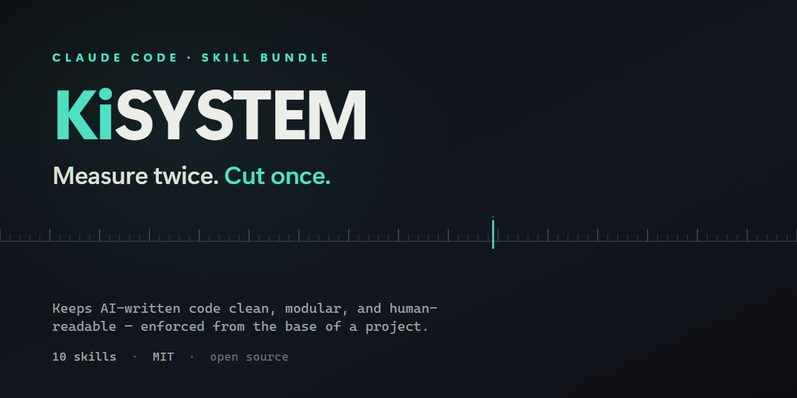

# KiSYSTEM



### *Keep It Simple, You Stupid Trained Electronic Monkey*

AI writes code fast — and often like a clever monkey: a 600-line file no human can read, three
copies of the same function because it never checked, and a "small refactor" that quietly broke
four things you weren't looking at. **KiSYSTEM is the discipline that makes the monkey measure
twice and cut once.** Complexity is brittle. Simple survives.

It's not a linter you bolt on at the end. You turn it on at the **base** of a project, and it keeps
the code clean *as it's written* — because the cheapest place to prevent bloat and breakage is the
wellspring, before either exists.

**It targets the two loudest complaints about AI-written code:**
- *"I can't read what the AI wrote."* → self-documenting, labeled, modular sections; a one-line
  synopsis on every function; comments that explain *why*. A human stays in the loop.
- *"The AI broke code that was working."* → blast-radius containment: a change stays inside its
  boundary, and the neighbors are checked before it's called done.

## The failure the monkey can't see (and why `kiss-coherence` exists)

The README above says the monkey writes *"three copies of the same function because it never checked."*
That was optimistic.

Retrofitting KiSYSTEM onto a real 127,000-line AI-built application, we found **eight** implementations of
a single concept — *"which items are installed?"* — reading four different stores. **Not one of them shared
a name.** They were called `LoadSpecialists`, `Enumerate`, `ExecuteToolList`, `BuildRosterContent`… so every
"does a twin already exist?" check **passed cleanly while the eighth duplicate was written.**

They had drifted. And the drift was not cosmetic — it was already shipping as bugs:

- an AI that **could not see its own data**, denied it existed, and proposed creating **duplicate ghost
  records** of it
- **~48 abilities silently dead** because two hand-maintained lists disagreed about what existed
- a **licence bypass** — unentitled users receiving paid features
- a headline feature **100% blank in production**, because *one* malformed record threw and a bare `catch`
  swallowed it
- two **retired entities that were still shipping** — deleted from the code cleanly, nothing left in version
  control, dead-code sweep green — yet still occupying **ten saved user records**, so a container that
  promised 17 members delivered 15, silently, forever

**None of them threw an exception. None of them failed a test.** 711 tests passed the entire time. They were
invisible to size audits, dead-code sweeps, doc-drift checks and coverage analysis.

> **Code can be locally immaculate — small files, clean names, one responsibility each — and globally
> incoherent, with one concept answered eight different ways.**
> **A size audit scores that codebase as excellent. Only a coherence pass sees it.**

`kiss-coherence` is the pass that sees it. Its method is one trick: **grep by STORE, not by concept name.**
Searching for `roster` finds nothing; searching for the *persistence* — the file glob, the table, the
singleton — finds every answerer. Then: one canonical accessor, everyone else delegates, and a pre-commit
guard **fails the build** when a new site starts deriving a concept that already has an owner.

**Run the pass BACKWARDS too.** The audit above asks *"how many places in code answer this question?"* — it
finds **contradiction**. Run each store the other way — ***"does every record in the store still have an owner
in code?"*** — and you find **residue**: entities deleted from code whose data was left behind, still in the
config, still being read, **still shipping**. Deleting an entity's *code* is not deleting the entity; it has a
footprint (assets, config rows, data folders, build output) and **nothing enumerates it unless someone built
an enumerator**. A dead-code sweep proves the *code* is gone and says nothing about the 4 MB corpse a wildcard
packaging glob is about to ship. *(Ours was one packaging step from the installer.)*

**Three more rules, all paid for in regressions:**

- **Consolidation is not free.** A condition often does two jobs: the one it states, and one nobody wrote
  down. Replacing it with something *cleaner and correct* can silently delete a rule — and **your test suite
  will not tell you**, because the rule was never tested; it was never even intended. *(This is how our own
  cleanup deleted a licence gate.)*
- **Record the negative finding.** When you investigate something suspicious and conclude *"actually, this is
  correct"* — **write that at the site.** Otherwise the next person repeats the whole investigation and
  eventually "fixes" it into a bug. *A "no bug here" finding that isn't written down is not a finding.*
- **Get the polarity of the fallback right, every time.** `unknown ⇒ allow` turns every routing accident into a
  **grant** — that is how the licence bypass happened. But the opposite is not a rule: in the very same
  codebase, a purge that drops what it cannot verify would **destroy user data**, so there `unknown ⇒ keep` is
  correct. Ask what the *unknown* case costs in **this** direction, not what it cost last time.

📄 **Full case study, with the numbers and the damage:** [`docs/RETROFIT-CASE-STUDY.md`](docs/RETROFIT-CASE-STUDY.md)

## The loop

> **Measure twice, cut once** — plan into the frame → the map says what already exists (and whether
> it has a twin) → write it as a labeled, reusable section → keep the change in its blast radius →
> guard the size → record what changed → confirm it landed clean.

## What's inside

One plugin, a thin `kiss` base skill orchestrating nine focused, independently-usable skills:

| Skill | Does |
|---|---|
| **`kiss`** | The base: the measure-twice-cut-once gate, project kickoff, routing. |
| **`kiss-plan`** | Orient in the frame, then a `design.md` — name the unit, check the map for a twin, find its slot, *then* write. |
| **`kiss-map`** | A cheap generated index (`.kiss/inert.md`) of what exists and where — so the agent never guesses or greps the whole tree. |
| **`kiss-readable`** | Bounded labeled sections, per-function synopses, why-comments, intention-revealing names. |
| **`kiss-modularity`** | One concern per unit, sections before files, size tiers — guards monoliths *and* over-fragmentation. |
| **`kiss-blast-radius`** | Keep a change inside its unit; verify the neighbors are untouched — and never delete a condition without asking what it was *incidentally* preventing. |
| **`kiss-coherence`** | **One question, one answer.** Exactly one canonical accessor per concept — catches the cross-cutting duplication that file-size and modularity audits structurally *cannot* see. |
| **`kiss-clean-edits`** | Extract-on-touch, surgical edits, YAGNI. |
| **`kiss-changelog`** | Record what changed and why when a cut lands. |
| **`kiss-debt-guard`** | A dependency-free size audit; systematic backup via git, not clutter; pointers to heavier guards. |

Each is small enough to read in one sitting and usable on its own — a system that preaches
modularity has to be modular itself — neither a monolith nor a thousand fragments. (The skills carry the `kiss-` prefix: KISS is the principle;
KiSYSTEM is the system built on it.)

## See it — don't take my word for it

`examples/kanban/` is a real terminal **and** web Kanban app, built entirely under KiSYSTEM — and
*evolved* under it: CLI → web UI → a glass theme → a deleted-card archive, each change
`design.md`-first with the core barely touched. Clone it and read it in order: `design.md` →
`MAP.md` → `CHANGELOG.md` → the `kanban/` modules. Ten minutes, and you'll see what the discipline
produces *and* how it holds up under feature-creep.

**An honest word on proof.** This is a *demonstration*, not a benchmark. The clean-edit reflex at
the core (`extract-on-touch`) is genuinely TDD-validated — built test-first against real agent
behavior (a documented baseline failure → a measured fix → a closed loophole). The rest of the
system is *shown*, not A/B-proven: a controlled "beats a vanilla agent" test can't be run honestly
inside an environment that already enforces clean code. So read the example, judge the output, and
trust the one reflex that's been through the wringer. Nothing here is claimed that isn't backed.

## Origins & credit

The **structure is the contribution** — the integration of these disciplines into one base-up
system is original, and most of it was designed independently while building real software,
adopting outside ideas only to fill genuine gaps (why reinvent the wheel?). Where the bricks aren't
mine, I say so: design docs as a practice aren't my invention, the planning discipline isn't, and
the behavioral-guardrail idea owes a debt to Andrej Karpathy's notes on LLM coding pitfalls. I
re-envisioned them and think I made them better; I don't claim their origin. Co-developed with
Claude Code. I claim what's mine — the whole machine, and the way it fits together.

## The code map (`.kiss/inert.md`)

A generated, project-local index of every symbol — `file · section · symbol · line · synopsis`.
The agent **greps it first** instead of reading source, so finding things is cheap and can't
hallucinate a location. It's gitignored — never ships, never drifts — and you regenerate it in one
pass whenever the structure changes. A *structural* index, deliberately not fuzzy vector search.

## Install

```
/plugin marketplace add Pr1m4lc0d3/KiSYSTEM
/plugin install kisystem@kisystem
```

Then invoke `kiss` at the start of a project. It plans, maps, sets a budget, and arms the guard —
then gets out of your way.

## Size-budget defaults (tunable)

`review` ~300 · `extract` ~500 · `hard-stop` ~800. Conservative public defaults — baseline them
from your real files, then ratchet down. The tiers matter more than the numbers.

## License

MIT — see [LICENSE](LICENSE).

---

## Where this came from

Deliberon is a Windows desktop app that runs a council of AI agents on a hard decision and hands
back a Decision Record: dissent preserved, every claim marked as proved, asserted, or estimated.

KiSYSTEM is the code discipline Deliberon is built under, published in full because a standard
enforced only by good intentions is not a standard.

Pay once, it's yours, no subscription. Thirty days of the full council with no account and no
card. Runs on your machine with your own model keys.

https://deliberon.com
